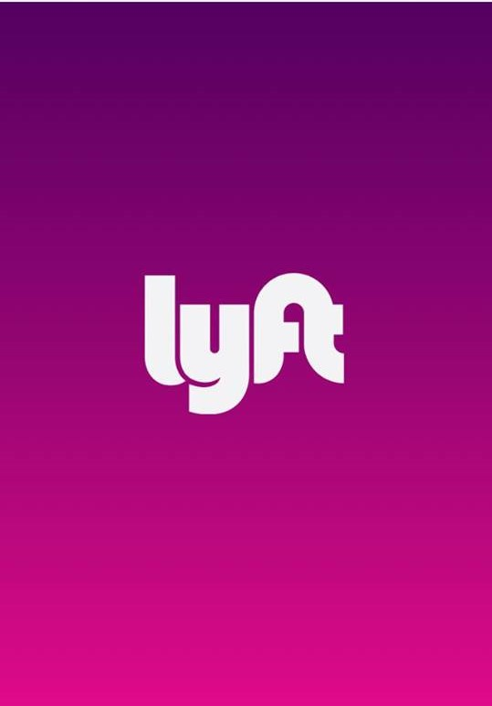

# Lyft

* **Track:** _Common Core_
* **Empresa:** _Proyecto elaborado por alumna de [Laboratoria](http://www.laboratoria.la/)_
* **Enlace:** [Enlace al proyecto](https://superliza.github.io/lyft-mobile/)

---

Permite a los usuarios registrarse en la plataforma Lyft mediante una web app que envía SMS de verificación al teléfono móvil ingresado.

**Se utilizaron las siguientes tecnologías:**

* `JavaScript`: Lenguaje de programación usado del lado del cliente.
* `jQuery`: Biblioteca de JavaScript usada para manipular el árbol DOM.
* `AJAX`: Técnica de desarrollo usada para crear una aplicación interactiva.
* `Materialize`: Framework responsivo de CSS basado en Material Design.
* `CSS`: Lenguaje de diseño usado para definir la presentación de la página.
* `HTML5`: Lenguaje de marcado usado para crear la estructura de la página.

---

# Capturas:

### Vista en móviles

